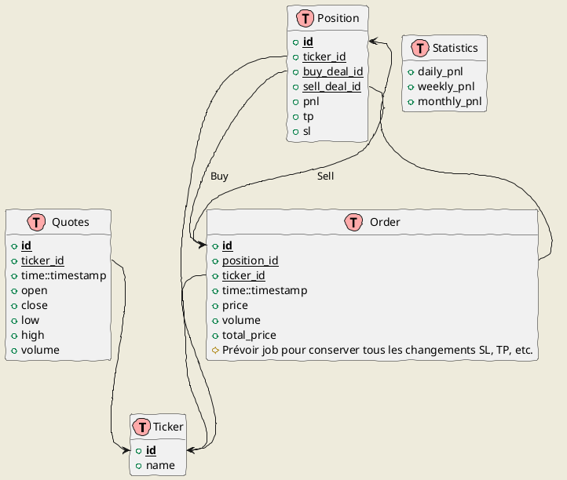

# trade

## TODO

1. [ ] Base de données locale pour stocker les quotes?
    * Pour commencer, faire avec un CSV ou fetcher les données à chaque fois

1. [ ] Récupérer les données Yahoo Finances

    * How?

1. [ ] Check if uptrend:

    * <https://medium.com/analytics-vidhya/super-performance-stocks-how-to-make-more-than-1-125-on-a-single-small-cap-stock-with-python-5ea3ae393791>

1. [ ] Auto Envelope?
    * ou alors Bandes de Bollinger?

1. [ ] Sortir Prix achat, SL, TP

1. [ ] Construire tableau récap sur la semaine et le mois

1. [ ] Panel statistics

## Datamodel

